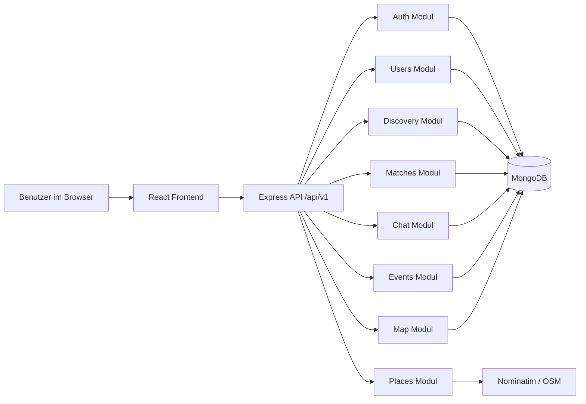

# PMA Komponentendiagramm

## Lesart
- Das Frontend ist der einzige direkte Einstiegspunkt fuer Nutzer.
- Das Backend kapselt die Fachlogik in klar getrennten Modulen.
- MongoDB ist die zentrale Persistenz fuer den MVP.
- Extern angebunden ist nur die Ortssuche.
