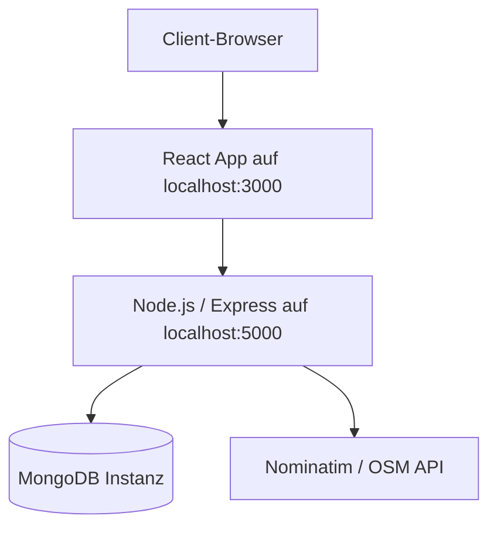

# PMA Deployment-Diagramm

## Lesart
- Frontend und Backend laufen im Entwicklungsbetrieb getrennt.
- Die Browser-App spricht nur mit dem Backend.
- Das Backend uebernimmt Persistenz und externe Ortsabfragen.
